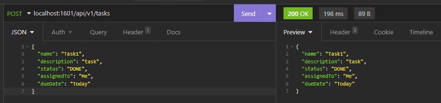
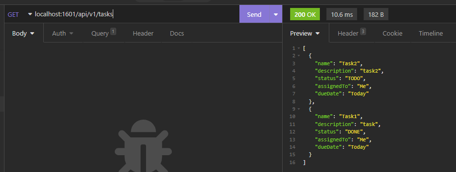
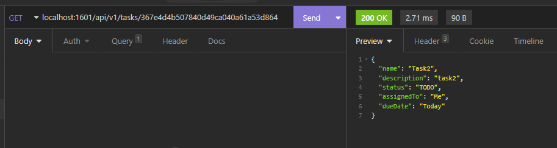
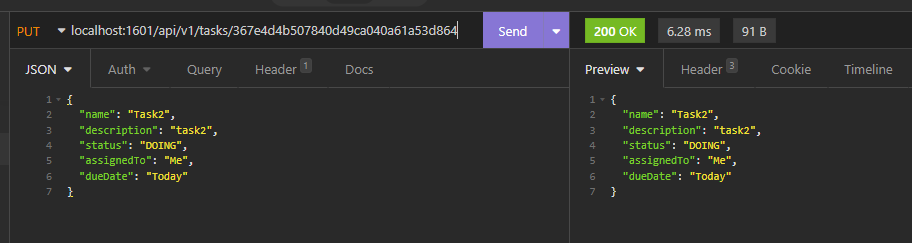
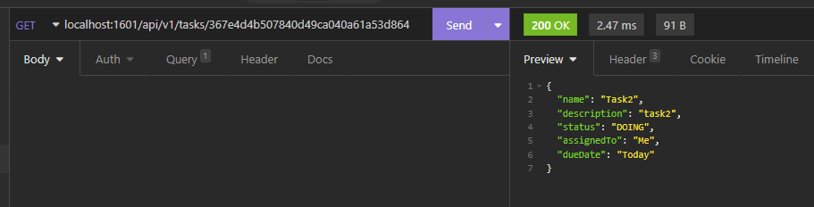
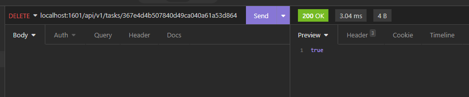
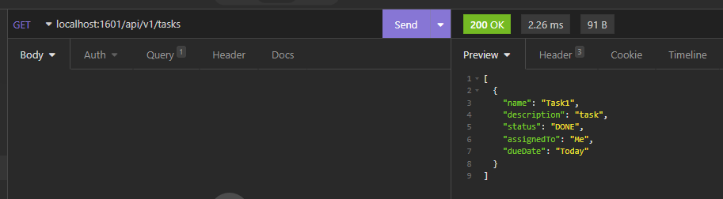

# IETI-TaskPlanner-Tasks

Task microservice created using Spring Boot

## Test Task Service

### Crete Task - POST

### Get all Tasks - GET

### Get Task by Id - GET

### Update Task - PUT

#### Check task Update

### Delete Task - DELETE

#### Check task delete

